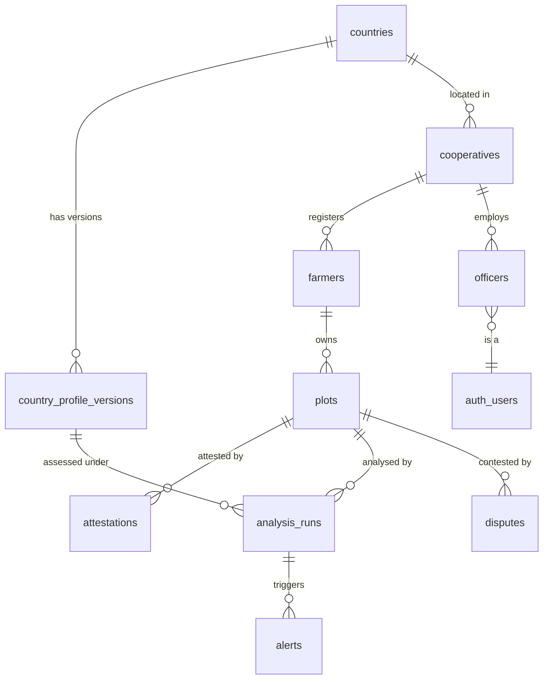

# SCHEMA.md — data model proposal (awaiting sign-off)

**Status: PROPOSAL. No migrations exist yet.** Per the working agreement I'm
waiting on your sign-off before generating `supabase/migrations/*.sql`. The DDL
below is illustrative — read it as the shape, not the final file. Questions that
need your call are collected at the bottom.

Related: DECISIONS.md (D-001 dates, D-003 forest definition, D-007 intake).

---

## Conventions

- **PKs:** `uuid` via `gen_random_uuid()`. Plots and farmers may be created
  **offline**, so the client generates the UUID at capture time — the row has a
  stable id before it ever reaches the server (offline-first, D-007).
- **Timestamps:** every time column is `timestamptz`, stored UTC. Render local,
  label the zone in the PDF (PROJECT.md "Time zones").
- **Geometry:** `geometry(Polygon, 4326)` for plots, `geometry(Point, 4326)`
  for capture locations. WGS84 is the canonical store (see decision §A).
- **Money/area:** hectares as `numeric(12,4)`; never `float` on a legal document.
- **Enums:** Postgres `enum` types for closed sets (status, verdict, method).
- **Soft delete:** `deleted_at timestamptz` where relevant; we rarely hard-delete
  field data.

## Entity overview



Tables: `countries`, `country_profile_versions`, `cooperatives`, `officers`,
`farmers`, `plots`, `attestations`, `analysis_runs`, `alerts`, `disputes`.
(`officers` and `auth.users` are additions the entity list implies but didn't
name — see §D.)

---

## A. Decision — how geometry is stored (and how area is computed)

**Store `geometry(Polygon, 4326)` (WGS84) as the single source of truth. Compute
hectares by reprojecting per-plot to an equal-area CRS, and record which EPSG was
used on the plot row.**

Why, and the alternative I weighed:

- PostGIS offers two spatial types. `geography` computes area/length on the
  spheroid directly — `ST_Area(geog)` returns m² globally with no projection
  choice. Tempting and simple. **But** PROJECT.md is explicit: reproject
  per-plot to an equal-area projection and *state the CRS used* on the legal
  document. `geography` hides that choice; an auditor can't see what produced
  the number. So `geometry(4326)` + an explicit reprojection wins on
  defensibility, not on convenience.
- **Which equal-area CRS?** The country profile carries `area_crs_epsg` (an
  equal-area projection — e.g. a national Albers/Lambert Azimuthal Equal Area,
  or a documented fallback like EPSG:6933 World Cylindrical Equal Area). Area is
  computed as `ST_Area(ST_Transform(geom, area_crs_epsg)) / 10000`. Any *proper*
  equal-area CRS returns correct hectares regardless of the plot's location, so
  a per-country equal-area projection is both accurate and auditable. We store
  the resulting `computed_area_ha` **and** `area_crs_epsg` on the plot, so the
  PDF states exactly how the number was derived. (Rejected: UTM per plot — UTM
  is conformal, not equal-area; the error is tiny at 0.5 ha but it's the wrong
  tool to name on a legal document.)
- **Validity is enforced, not hoped for.** A `CHECK` on `ST_IsValid(geom)` plus
  SRID = 4326, and the capture flow refuses self-intersecting polygons (D-007).
  A **GiST index** on `geom` powers overlap detection (`ST_Intersects` against
  existing plots) — the constant real-world dispute case.

```sql
-- illustrative
CREATE TABLE plots (
  id              uuid PRIMARY KEY DEFAULT gen_random_uuid(),
  farmer_id       uuid NOT NULL REFERENCES farmers(id),
  cooperative_id  uuid NOT NULL REFERENCES cooperatives(id),
  country_code    text NOT NULL REFERENCES countries(code),   -- confirmed, see D-003
  commodity       text NOT NULL,
  geom            geometry(Polygon, 4326) NOT NULL,
  claimed_area_ha numeric(12,4),                              -- what the farmer says
  computed_area_ha numeric(12,4),                             -- from geometry
  area_crs_epsg   integer,                                    -- CRS used for the number
  capture_method  capture_method NOT NULL,                    -- enum, see below
  status          plot_status NOT NULL DEFAULT 'draft',
  current_run_id  uuid REFERENCES analysis_runs(id),          -- denormalized 'latest verdict'
  captured_at     timestamptz NOT NULL,                       -- when taken in the field (UTC)
  synced_at       timestamptz,                                -- when it reached the server
  created_at      timestamptz NOT NULL DEFAULT now(),
  deleted_at      timestamptz,
  CONSTRAINT plots_geom_valid CHECK (ST_IsValid(geom) AND ST_SRID(geom) = 4326)
);
CREATE INDEX plots_geom_gix ON plots USING gist (geom);

CREATE TYPE capture_method AS ENUM ('imported','traced','corners','walked');
CREATE TYPE plot_status AS ENUM (
  'draft','captured','attested','queued','analyzing',
  'clear','flagged','insufficient_data','monitoring','error'
);
```

`capture_method` is recorded because a traced polygon and a walked one deserve
different confidence, and an auditor will ask (PROJECT.md).

---

## B. Decision — country profiles are immutable versioned rows (reproducibility)

This is the one you flagged: a country can change its forest definition, and old
verdicts must stay reproducible. **`country_profile_versions` is append-only.
Changing a forest definition inserts a new version; it never UPDATEs an existing
one. Every `analysis_run` stores a FK to the exact version it used — so an old
verdict points at the exact rules that produced it, forever.**

`countries` holds stable identity + a pointer to the current version;
`country_profile_versions` holds the versioned config.

```sql
CREATE TABLE countries (
  code                text PRIMARY KEY,          -- ISO-3166 alpha-2
  name                text NOT NULL,
  current_version_id  uuid                       -- -> country_profile_versions.id
);

CREATE TABLE country_profile_versions (
  id                    uuid PRIMARY KEY DEFAULT gen_random_uuid(),
  country_code          text NOT NULL REFERENCES countries(code),
  version               integer NOT NULL,        -- 1,2,3… per country
  -- assessment rules:
  deforestation_cutoff_date date NOT NULL,       -- e.g. 2020-12-31 (D-001/D-002)
  canopy_cover_pct      numeric(5,2) NOT NULL,   -- forest definition …
  min_area_ha           numeric(8,4) NOT NULL,   -- … these genuinely differ
  min_tree_height_m     numeric(5,2) NOT NULL,   -- … by country (PROJECT.md)
  commodities           text[] NOT NULL,
  default_language      text NOT NULL,           -- BCP-47, e.g. 'si','ta','id'
  area_crs_epsg         integer NOT NULL,        -- equal-area CRS for hectares (§A)
  id_scan_method        text NOT NULL,           -- 'qr' | 'pdf417' | 'mrz' | 'ocr' (D-007)
  protected_area_source text,
  effective_from        date NOT NULL,
  created_at            timestamptz NOT NULL DEFAULT now(),
  UNIQUE (country_code, version)
);
```

The alternative, and why not:

- **Mutable profile + audit log**, or a temporal SCD-type-2 table. Both can
  reconstruct history, but reproducibility becomes a *reconstruction* task
  (replay the log to the run date) rather than a *direct reference*. For a legal
  document I want the run to point straight at immutable rules — no replay, no
  ambiguity about which values were live at run time.
- **Belt-and-braces:** because a version row could in theory be edited or
  deleted years later, each `analysis_run` **also snapshots** the effective
  values it used into a `profile_snapshot jsonb`. So a run is self-contained for
  PDF generation even if the version table changes underneath it. The version
  FK is the normalized truth; the snapshot is the durable copy. Small
  duplication, large payoff in auditability — worth it here.

"Adding a country is adding rows, never a code change" (PROJECT.md) holds: new
country = one `countries` row + one `country_profile_versions` row.

---

## C. Decision — `analysis_runs` carries the verdict; `alerts` and monitoring hang off runs

A plot is analysed **many** times: first pass, re-runs, and every later
monitoring pass. Each execution is one `analysis_run` (one queued job). The
**verdict is the output of a run, 1:1**, so verdict fields live *on* the run
rather than in a separate `verdicts` table — a separate table would be a strict
1:1 join with no added meaning. The plot's "current verdict" is the denormalized
`plots.current_run_id` pointer, for fast list views.

I'm flagging this because your entity list named "verdicts" separately — this is
me folding it in on purpose. If you'd rather have a queryable `verdicts` table
(e.g. to answer "every verdict ever issued for this plot" without scanning runs),
say so; it's a cheap change now and painful later.

- **Forest-fraction time series** → `jsonb` on the run. It's read and written as
  a whole (straight from/into the service payload and the PDF chart); we don't
  query across plots by individual observation date today. (Alternative: a
  normalized `forest_fraction_points` child table — only worth it if we later
  need cross-plot temporal queries. Noted, not built.)
- **Imagery tiles** → `jsonb` metadata on the run; the PNG files live in a
  Supabase Storage bucket. The run stores the tile role, storage path,
  acquisition date, sensor, cloud cover.
- These `jsonb` shapes are exactly the `AnalysisResult` type the stub already
  emits (`lib/analysis/types.ts`) — DB and service contract stay in lockstep.

```sql
CREATE TYPE verdict AS ENUM ('clear','flagged','insufficient_data');
CREATE TYPE job_status AS ENUM ('queued','running','succeeded','failed');

CREATE TABLE analysis_runs (
  id                 uuid PRIMARY KEY DEFAULT gen_random_uuid(),
  plot_id            uuid NOT NULL REFERENCES plots(id),
  profile_version_id uuid NOT NULL REFERENCES country_profile_versions(id),
  profile_snapshot   jsonb NOT NULL,             -- durable copy of the rules used (§B)
  job_id             text,                        -- the service's job handle
  job_status         job_status NOT NULL DEFAULT 'queued',
  is_monitoring      boolean NOT NULL DEFAULT false, -- scheduled re-check vs first pass
  -- outputs (null until job_status = 'succeeded'):
  verdict            verdict,
  confidence         numeric(4,3),
  forest_fraction_series jsonb,
  clearing_earliest  date,
  clearing_latest    date,
  cleared_hectares   numeric(12,4),
  imagery            jsonb,
  model_version      text,
  data_accessed_at   timestamptz,
  requested_at       timestamptz NOT NULL DEFAULT now(),
  completed_at       timestamptz,
  error              text
);
CREATE INDEX analysis_runs_plot_idx ON analysis_runs (plot_id, requested_at DESC);
```

---

## D. The remaining tables

```sql
-- Cooperatives: the paying/operating org. Belongs to a country.
CREATE TABLE cooperatives (
  id                uuid PRIMARY KEY DEFAULT gen_random_uuid(),
  country_code      text NOT NULL REFERENCES countries(code),
  name              text NOT NULL,
  default_commodity text,
  contact_email     text,
  created_at        timestamptz NOT NULL DEFAULT now()
);

-- Officers: the operator. A profile linked to Supabase auth (magic-link only).
-- 'auth.users' is Supabase-managed; officers extends it with app data.
CREATE TABLE officers (
  id             uuid PRIMARY KEY REFERENCES auth.users(id),
  cooperative_id uuid REFERENCES cooperatives(id),
  full_name      text,
  role           text NOT NULL DEFAULT 'officer',  -- 'officer' | 'exporter' | 'admin'
  created_at     timestamptz NOT NULL DEFAULT now()
);

-- Farmers: mostly imported from the co-op roster (D-007). PII lives here.
CREATE TABLE farmers (
  id             uuid PRIMARY KEY DEFAULT gen_random_uuid(),  -- client-generatable
  cooperative_id uuid NOT NULL REFERENCES cooperatives(id),
  country_code   text NOT NULL REFERENCES countries(code),
  full_name      text NOT NULL,
  national_id    text,                              -- PII — see open question Q3
  id_image_path  text,                              -- PII — may be forbidden per country
  membership_no  text,
  village        text,
  phone          text,
  captured_via   text NOT NULL,                     -- 'roster_import'|'id_scan'|'manual'
  consent_at     timestamptz,                       -- when the farmer consented (D-007)
  created_at     timestamptz NOT NULL DEFAULT now(),
  deleted_at     timestamptz
);

-- Attestations: what turns a polygon into evidence. Snapshots identity at
-- attestation time so later edits to the farmer row can't rewrite the record.
CREATE TABLE attestations (
  id                  uuid PRIMARY KEY DEFAULT gen_random_uuid(),
  plot_id             uuid NOT NULL REFERENCES plots(id),
  officer_id          uuid NOT NULL REFERENCES officers(id),
  captured_at         timestamptz NOT NULL,          -- auto, UTC
  officer_location    geometry(Point, 4326),         -- where the officer stood
  photo_path          text NOT NULL,                 -- geotagged plot photo (Storage)
  farmer_confirmed    boolean NOT NULL DEFAULT false,
  confirmation_method text,                          -- 'signature' | 'thumbprint'
  signature_path      text,                          -- the on-screen mark (Storage)
  farmer_name_snapshot text NOT NULL,                -- identity as attested
  farmer_id_snapshot   text,
  created_at          timestamptz NOT NULL DEFAULT now()
);

-- Alerts: standing monitoring. A later run detects new clearing → alert the
-- exporter before the shipment leaves.
CREATE TABLE alerts (
  id               uuid PRIMARY KEY DEFAULT gen_random_uuid(),
  plot_id          uuid NOT NULL REFERENCES plots(id),
  analysis_run_id  uuid NOT NULL REFERENCES analysis_runs(id),  -- the run that fired it
  severity         text NOT NULL DEFAULT 'new_clearing',
  status           text NOT NULL DEFAULT 'new',        -- 'new'|'acknowledged'|'resolved'
  notified_at      timestamptz,
  created_at       timestamptz NOT NULL DEFAULT now()
);

-- Disputes / public feedback: two sources in one table —
--  (a) public-layer confirm/dispute on a flagged patch (no login, geometry-based),
--  (b) plot-level disputes (e.g. overlap between two farmers' plots).
-- Both double as labelled training data (PROJECT.md free public layer).
CREATE TABLE disputes (
  id             uuid PRIMARY KEY DEFAULT gen_random_uuid(),
  subject_type   text NOT NULL,                       -- 'plot' | 'public_flag'
  plot_id        uuid REFERENCES plots(id),           -- null for public_flag
  geom           geometry(Point, 4326),               -- for public_flag / where reported
  stance         text NOT NULL,                       -- 'confirm' | 'dispute'
  reporter_id    uuid REFERENCES officers(id),        -- null = anonymous public
  photo_path     text,
  comment        text,
  status         text NOT NULL DEFAULT 'open',
  created_at     timestamptz NOT NULL DEFAULT now()
);
```

---

## Access control (sketch, not for this migration)

Row Level Security by cooperative: officers read/write only their cooperative's
farmers/plots/attestations. Exporters read plots + alerts for cooperatives they
buy from. The public layer is a read-only view of *flagged clearing only* (no
farmer PII) plus insert-only access to `disputes`. RLS policies come in a later
migration once the tables are signed off.

---

## Open questions — need your call before I write migrations

1. **Verdict as columns vs. a `verdicts` table (§C).** I folded verdict onto
   `analysis_runs`. Keep it folded, or split it out? (Recommend: keep folded.)
2. **Time series storage (§C).** `jsonb` on the run vs. a normalized child
   table. (Recommend: `jsonb` now.)
3. **PII (D-007).** Do we store `national_id` and `id_image_path` at all, and
   under what consent? Should a country profile be able to *forbid* storing the
   ID image? This shapes the `farmers` columns and RLS — I don't want to guess.
4. **Exporter ↔ cooperative link.** One exporter buys from many cooperatives;
   a cooperative may sell to several. Model now as a join table, or defer until
   the monitoring/alerts feature is actually built? (Recommend: defer.)
5. **Overlap disputes.** Model plot-vs-plot overlap as a `disputes` row (as
   above), or as a dedicated `plot_overlaps` table with both plot FKs? (Recommend:
   start in `disputes`; promote later if it needs its own workflow.)

Answer these (or just say "go with your recommendations") and I'll generate the
first migration: PostGIS enablement, enums, and these tables, in dependency order.
